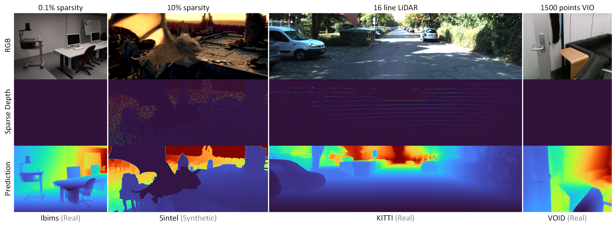

# 🚀 ICCV 2025: PacGDC

[**PacGDC: Label-Efficient Generalizable Depth Completion with Projection Ambiguity and Consistency**](https://arxiv.org/abs/2507.07374)

**Haotian Wang, Aoran Xiao, Xiaoqin Zhang, Meng Yang, and Shijian Lu**

*International Conference on Computer Vision (ICCV), October 2025*

---

## 📝 Abstract



**PacGDC** is a label-efficient technique that enhances data diversity with minimal annotation effort for generalizable depth completion. It builds on novel insights into inherent *ambiguities and consistencies* in object shapes and positions during 2D-to-3D projection, allowing the synthesis of numerous pseudo geometries for the same visual scene. This process greatly broadens available geometries by manipulating scene scales of the corresponding depth maps. To leverage this property, we propose a new data synthesis pipeline that uses multiple depth foundation models as scale manipulators. These models robustly provide pseudo depth labels with varied scene scales, affecting both local objects and global layouts, while ensuring projection consistency that supports generalization. To further diversify geometries, we incorporate interpolation and relocation strategies, as well as unlabeled images, extending the data coverage beyond the individual use of foundation models.

---

## ⚙️ Requirements

- Python >= 3.9
- PyTorch >= 2.7

---

## 🏋️‍♂️ Training

### 1️⃣ Prepare Your Data

- Save your training datasets in `./Datasets/Data_Train`:

```
└── Data_Train
  ├── Labeled         # Labeled datasets
  │   ├── Dataset1
  │   │   ├── rgb
  │   │   │   ├── file1.png
  │   │   │   ├── file2.png
  │   │   │   └── ...
  │   │   ├── depth
  │   │   │   ├── file1.png
  │   │   │   ├── file2.png
  │   │   │   └── ...
  │   │   ├── DA      # DepthAnything Results
  │   │   │   ├── file1.png
  │   │   │   ├── file2.png
  │   │   │   └── ...
  │   │   └── DepthPro # DepthPro Results
  │   │       ├── file1.png
  │   │       ├── file2.png
  │   │       └── ...
  │   └── Dataset2
  │       └── ...
  └── UnLabeled       # Unlabeled datasets
      ├── Dataset1
      │   ├── rgb
      │   │   └── ...
      │   ├── DA
      │   │   └── ...
      │   ├── DepthPro
      │   │   └── ...
      └── Dataset2
        └── ...
```

> ⚠️ **Note:**  
> - `depth` should be stored in 16-bit format, normalized by `depth(m)/max_depth(m)*65535`.  
> - `max_depth=30(m)` for indoor datasets, `max_depth=150(m)` for outdoor datasets.

- Save your hole datasets in `./Datasets/Data_Hole`:

```
└── Hole_Datasets
  ├── Dataset1
  │   ├── file1.png
  │   ├── file2.png
  │   └── ...
  └── Dataset2
      ├── file1.png
      ├── file2.png
      └── ...
```

> ⚠️ **Note:**  
> - Hole maps should be stored in Uint8 format.  
> - `valid pixels = 255`, `invalid pixels = 0`.  
> - Example: [Hole collected from HRWSI](https://drive.google.com/file/d/1iKJEWgd36ebEVbG-01_gDipYuCCs7ZQZ/view?usp=drive_link)

---

### 2️⃣ Start Training

- Run `train.py`:

```bash
# model_type: ["T", "S", "B", "L"] referring to SPNet
python train.py --model_type="L" --foundation_models="DA_DepthPro"
# All configuration parameters are located in ".\src\configs.py" and can be customized as required.
```

- The trained model will be saved in `./logs/models`

---

## 🧪 Testing
1. Download and locally save the `Zero-Shot Checkpoint` to `./Pretrained`

| Checkpoints                                                                                    | Model Type    | Foundation Models | Drop rate
| --------------------------------------------------------------------------------------------------- |:-------:|:-------:|:-------:|
| [Zero-shot](https://huggingface.co/Haotian-sx/PacGDC_large/blob/main/L_DA_DepthPro.pth)    | SPNet-Large      | DA, DepthPro  | 0.5 |
| [KITTI Finetuned (Online Leaderboard)](https://huggingface.co/Haotian-sx/PacGDC_large/blob/main/L_DA_DepthPro_KITTI.pt)   | SPNet-Large     | DA, DepthPro  | 0.8 |

- If you want to load `Zero-Shot Checkpoint` using hugging face:
``` python
# update test.py as follows:

# hugging face loading
net = CompletionNet.from_pretrained("Haotian-sx/PacGDC_large")
# locally loading
# net = CompletionNet(str(args.ckpt_path.name)[0]).to(args.device).eval()
# net.load_state_dict(torch.load(args.ckpt_path)["network"])
```

2. Download and unzip [Test Dataset (Ibims)](https://drive.google.com/file/d/10tME1cuV0PVxrFLauTlv5SdQbZLUfdGy/view?usp=drive_link) to `./Datasets/Data_Test`
3. ▶️ Run `test.py`:

```bash
# 1. Normalize depth values to [0,1] by "depth(m)/max_depth(m)*65535"
# (The provided "Test Dataset (Ibims)" is already normalized with max_depth=30 (Indoor))

# 2. Run test.py
python test.py --ckpt_path="Pretrained/L_DA_DepthPro.pth" --max_depth=30
```
> ⚠️ **Note:**  
> - `KITTI Fine-tuned Checkpoints` are released for autonomous driving applications. This repository does not reimplement few-shot/full-shot fine-tuning, as existing public repositories like [LRRU](https://github.com/YufeiWang777/LRRU) and [CompletionFormer](https://github.com/youmi-zym/CompletionFormer) already provide effective solutions.

---

## 📈 Research Trajectory

🟢 [G2-MonoDepth](https://github.com/Wang-xjtu/G2-MonoDepth) *(Framework)*  → 🔵 [SPNet](https://github.com/Wang-xjtu/SPNet) *(Network)*  → 🔴 [PacGDC](https://github.com/Wang-xjtu/PacGDC) *(Data)*

---

## 📚 Citation

If you find our work useful, please cite:

```bibtex
@article{wang2025pacgdc,
  title     = {PacGDC: Label-Efficient Generalizable Depth Completion with Projection Ambiguity and Consistency},
  author    = {Wang, Haotian and Xiao, Aoran and Zhang, Xiaoqin and Yang, Meng and Lu, Shijian},
  journal   = {arXiv preprint arXiv:2507.07374},
  year      = {2025},
  url       = {https://arxiv.org/abs/2507.07374}
}
```
